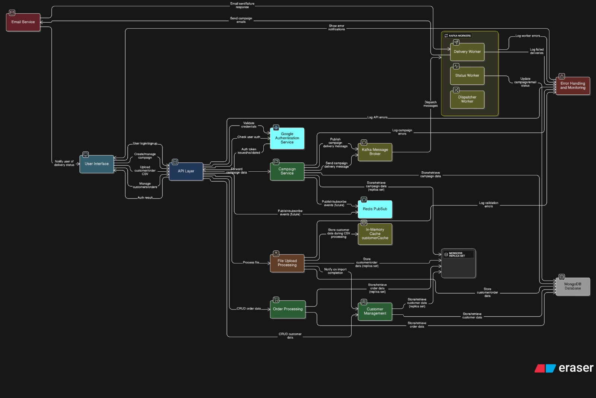
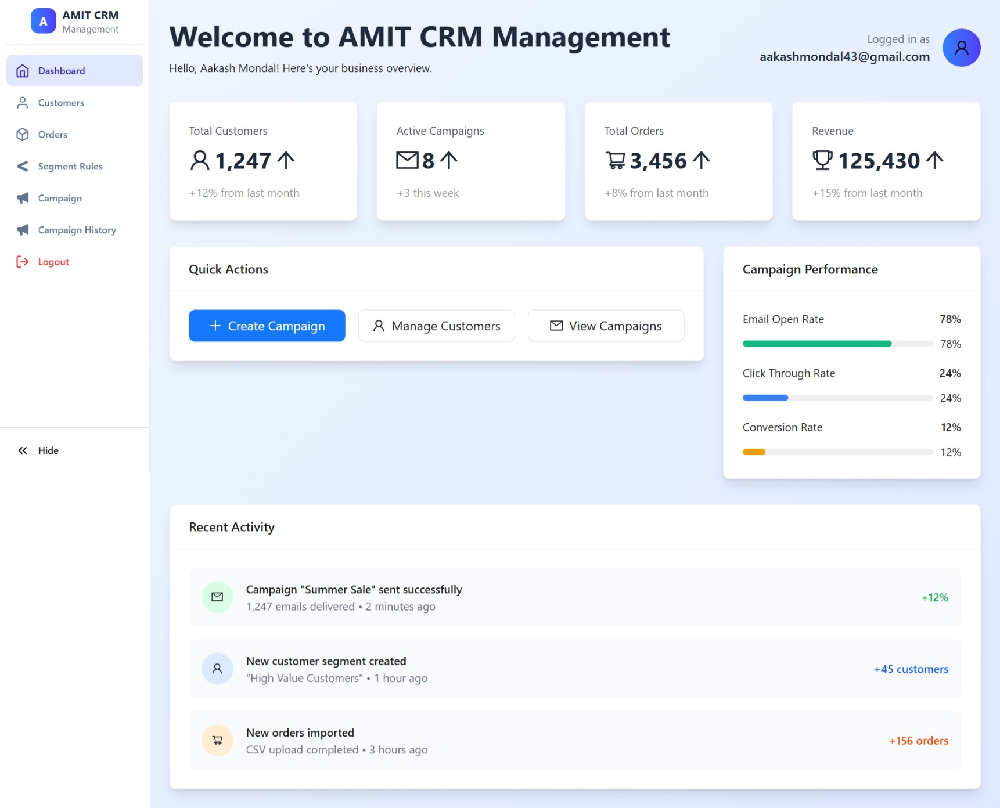
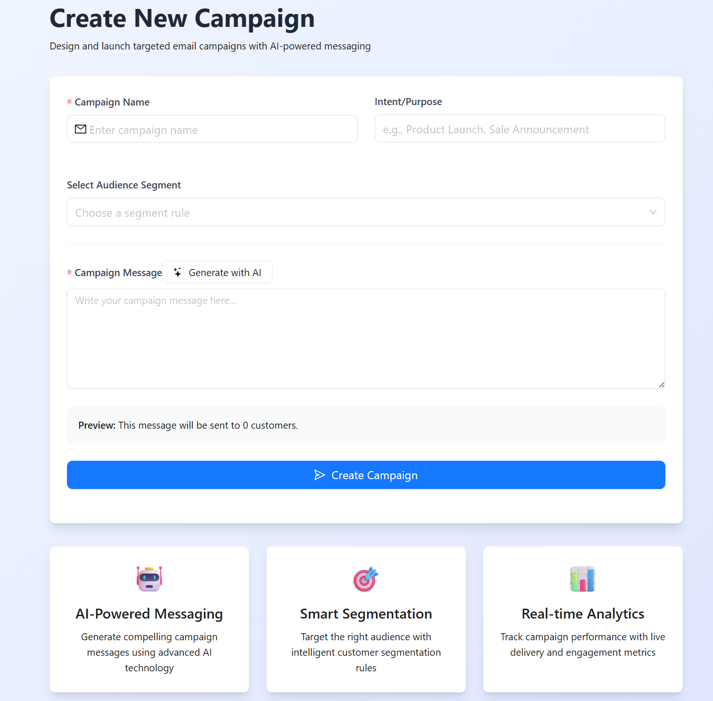
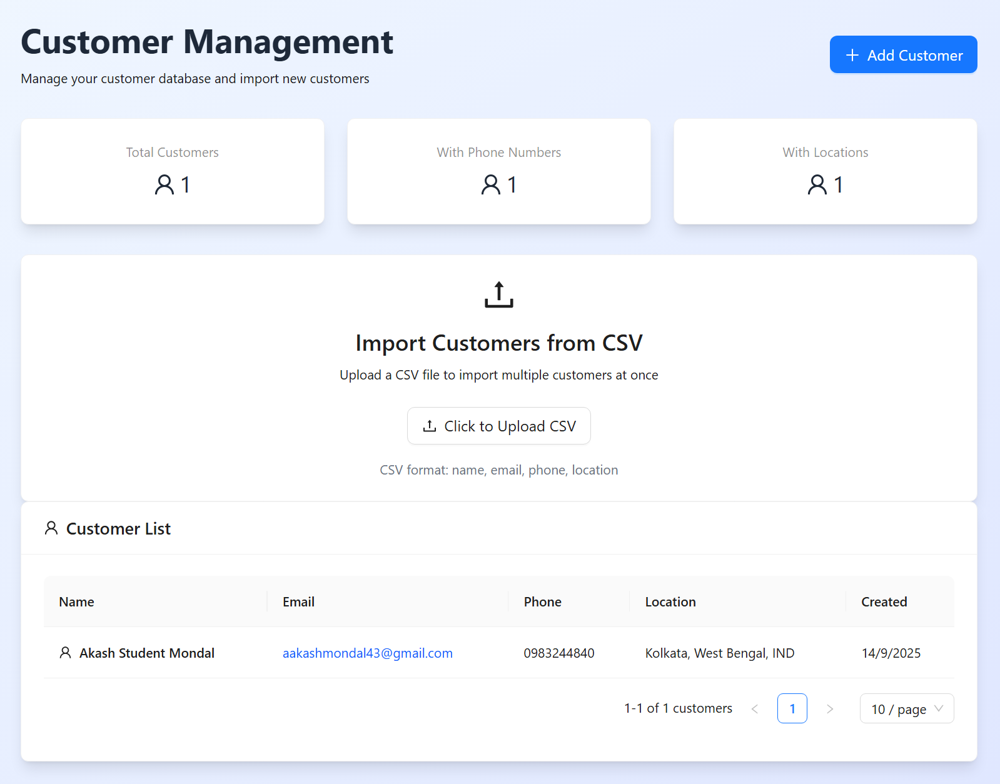
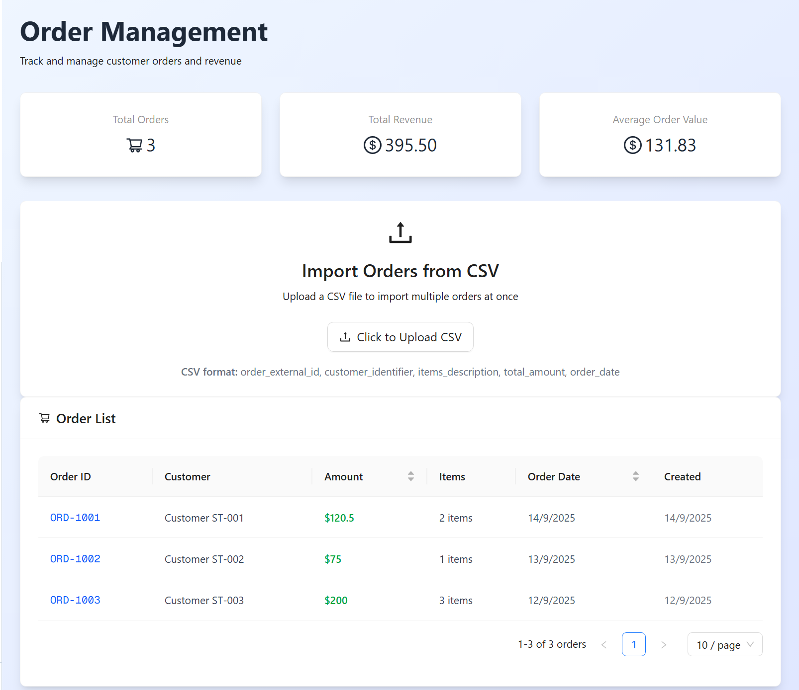
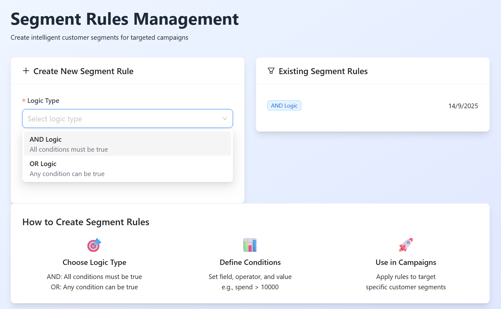

# Mini CRM Platform - Xeno SDE Internship Assignment 2025

This project is a Mini CRM Platform built as part of the Xeno SDE Internship Assignment. It enables customer segmentation, personalized campaign delivery, and incorporates AI-powered features.

 **Assignment Goal:** Build a Mini CRM Platform that enables customer segmentation, personalized campaign delivery, and intelligent insights using modern tools and approaches.

---

## Table of Contents

1.  [Live Demo](#live-demo)
2.  [Demo Video](#demo-video)
3.  [Features Implemented](#features-implemented)
4.  [Tech Stack](#tech-stack)
5.  [Architecture Diagram](#architecture-diagram)
6.  [Getting Started](#getting-started)
    # Mini CRM

    Comprehensive README for the Mini CRM project (frontend + backend). This document covers architecture, developer setup, environment variables, available scripts, project structure, and quick troubleshooting.

    Links
    - Architecture board (Eraser): https://app.eraser.io/workspace/36ANjKUhFR08RVT2h4PA?origin=share

    Contents
    - Project overview
    - Architecture
    - Repo layout
    - Getting started (backend & frontend)
   # Mini CRM 

   Comprehensive README for the Mini CRM project (frontend + backend). This document covers architecture, developer setup, environment variables, available scripts, project structure, and quick troubleshooting.

   Links
   - Architecture board (Eraser): https://app.eraser.io/workspace/36ANjKUhFR08RVT2h4PA?origin=share

   Contents
   - Project overview
   - Architecture
   - Repo layout
   - Getting started (backend & frontend)
   - Environment variables
   - Scripts & development workflow
   - Testing & linting notes
   - Known limitations & future work

   Project overview
   This repository contains a Mini CRM platform that supports:
   - Customer and order ingestion (CSV upload)
   - Audience segmentation via flexible rules
   - Campaign creation and (simulated) delivery logging
   - Google OAuth based authentication
   - AI-driven campaign message suggestions (via Google Gemini integration)

   Architecture (high level)
   - Frontend: Next.js app (App Router, React 19)
   - Backend: Node.js + Express + TypeScript
   - Database: MongoDB (Mongoose models present in `backend/src/models`)
   - Message broker / workers: Kafka related code exists (`kafkajs` in dependencies) for dispatching delivery jobs and workers in `backend/src/workers`
   - AI: A Next.js API route and/or backend service integrates with Google Gemini to generate message suggestions
   - Auth: Google OAuth 2.0 (frontend uses `@react-oauth/google`, backend validates tokens)

   

   *Figure: High-level architecture — frontend, API layer, backend services, Kafka workers and external integrations.*

   Repository layout
   - /backend: Express + TypeScript backend
     - src/
      - apis/: controllers, routes and services
      - models/: Mongoose models (`Customer`, `Order`, `Campaign`, `User`, `DeliveryLog`, ...)
      - utils/: helpers (DB connect, mailer, kafka, response helpers)
      - workers/: background workers (delivery, dispatcher, status)
      - docs/: swagger docs
     - package.json (dev & start scripts)

   - /frontend: Next.js (App Router)
     - app/: Next.js pages and API routes
     - components/: UI components and blocks
     - public/: static assets
     - store/: client-side state (Zustand)
     - package.json (dev/build/start scripts)

   Screenshots / UI Preview
   ------------------------
   Below are screenshots from the project UI to showcase the main screens. Images are stored at the repository root. The gallery below places two images per row for easier comparison.

   | Dashboard | Campaign |
   |---:|:---|
   |    *Dashboard: overview & quick stats* |    *Campaign creation: message editor & audience* |

   | Customers | Orders |
   |---:|:---|
   |    *Customer list & profile* |    *Orders list & details* |

   | Segmentation Rule Builder | Architecture |
   |---:|:---|
   |    *Rule builder: field / operator / value* |    *High-level architecture (frontend → workers → db → 3rd party)* |

   Getting started — prerequisites
   - Node.js (v18+ recommended)
   - npm (v9+) or yarn
   - MongoDB (local or Atlas)
   - Google Cloud OAuth 2.0 credentials (for Google sign-in)
   - (Optional) Google Gemini API key for AI features

   Quick start — backend
   1. Open a terminal and change to the backend folder:
      - `cd backend`

   2. Install dependencies:
      - `npm install`

   3. Create `.env` in `backend/` (example variables below).

   4. Development start (uses `nodemon` + `ts-node`):
      - `npm run dev`

   5. Build & start (production):
      - `npm run build`
      - `npm start`

   Backend package.json scripts (extracted)
   - `dev`: `nodemon src/index.ts` — start in development with automatic reload
   - `build`: `tsc` — compile TypeScript to `dist/`
   - `start`: `node dist/index.js` — start compiled production server

   Quick start — frontend
   1. Open a terminal and change to the frontend folder:
      - `cd frontend`

   2. Install dependencies:
      - `npm install`

   3. Create `.env.local` in `frontend/` (example variables below).

   4. Run the dev server:
      - `npm run dev`

   Frontend package.json scripts (extracted)
   - `dev`: `next dev` — runs Next.js in development
   - `build`: `next build` — build for production
   - `start`: `next start` — start production server
   - `lint`: `next lint`

   Environment variables
   Create the following environment files with the described variables.

   Backend (`backend/.env`) — example
   - `PORT=5001`
   - `MONGO_URI=mongodb://localhost:27017/backup-crm` (or your Atlas connection string)
   - `JWT_SECRET=your_jwt_secret` (if used for custom tokens)
   - `GOOGLE_CLIENT_ID=your_google_client_id`
   - `GOOGLE_CLIENT_SECRET=your_google_client_secret`
   - `KAFKA_BROKER=localhost:9092` (if running Kafka locally)
   - Any other variables used in `backend/src/utils` (mailer credentials, SMTP config, etc.)

   Frontend (`frontend/.env.local`) — example
   - `NEXT_PUBLIC_GOOGLE_CLIENT_ID=your_google_client_id`
   - `NEXT_PUBLIC_BACKEND_URL=http://localhost:5001`
   - `GEMINI_API_KEY=your_gemini_api_key` (if frontend directly calls Gemini; otherwise keep it server-side)

   Notes on security
   - Keep secrets out of source control. Use `.env` / `.env.local` and add them to `.gitignore`.
   - Prefer calling third-party AI services from the backend to avoid leaking API keys in the browser.

   Testing & linting
   - There are no unit tests in the repository currently. Consider adding Jest or Vitest for unit tests and Supertest for API integration tests.
   - Frontend includes `next lint` script; configure ESLint and Prettier as preferred.

   Developer workflow & tips
   - Backend
     - Implement new controllers under `backend/src/apis/controllers` and wire routes in `backend/src/apis/routes`.
     - Models in `backend/src/models` are Mongoose-based. Use `backend/src/utils/connectDb.ts` to establish DB connection.
     - Workers in `backend/src/workers` use Kafka for dispatch and status updates. If you don't have Kafka during local dev, either run a local Kafka (e.g., using Docker) or stub out worker calls.

   - Frontend
     - Next.js App Router is used. Pages/components live inside `frontend/app` and `frontend/components`.
     - Client-side auth uses `frontend/store/useAuthStore.ts` (Zustand) — update token handling and backend URL as needed.

   Architecture notes & diagram
   - The repository includes an architecture diagram (`architeccture.jpeg`) and an Eraser board link (above) that provides the full component interactions for:
     - File upload processing flow
     - Campaign creation, dispatch, worker processing, and delivery logging
     - Redis or in-memory caching for customer sets (used during processing)
     - Kafka message broker and background workers

   Known limitations (short)
   - No automated tests included
   - Some campaign delivery paths are simulated rather than integrated with a real email vendor
   - Audience size preview and a full campaign history UI are incomplete

   Suggested next steps (for contributors)
   1. Add unit & integration tests for backend APIs (Jest + Supertest).
   2. Add a CI workflow to run linting, tests, and builds on PRs.
   3. Add docker-compose for local dev (MongoDB + optional Kafka + Zookeeper).
   4. Move AI calls server-side and add rate-limiting and caching for prompts.

   Contact / Attribution
   - Creator: Project structure suggests this was authored for an SDE internship assignment.

   License
   - No license file present. Add a `LICENSE` if you intend to open-source this repository.

   -- End of README --
